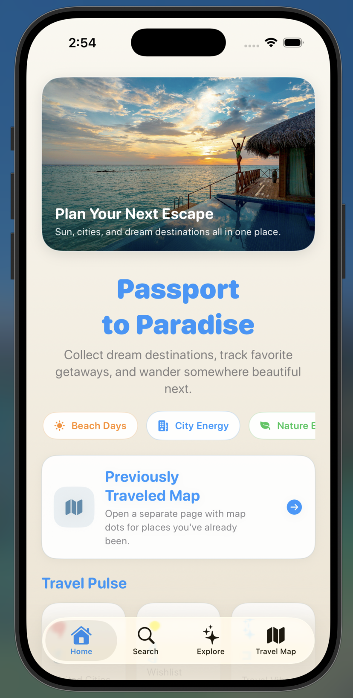
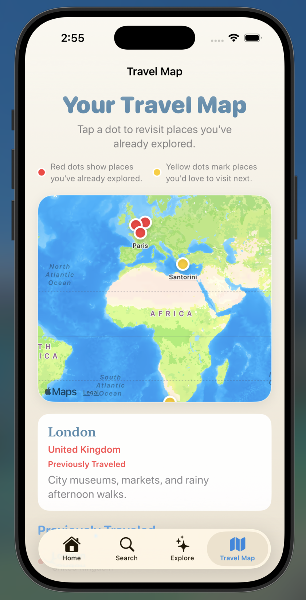
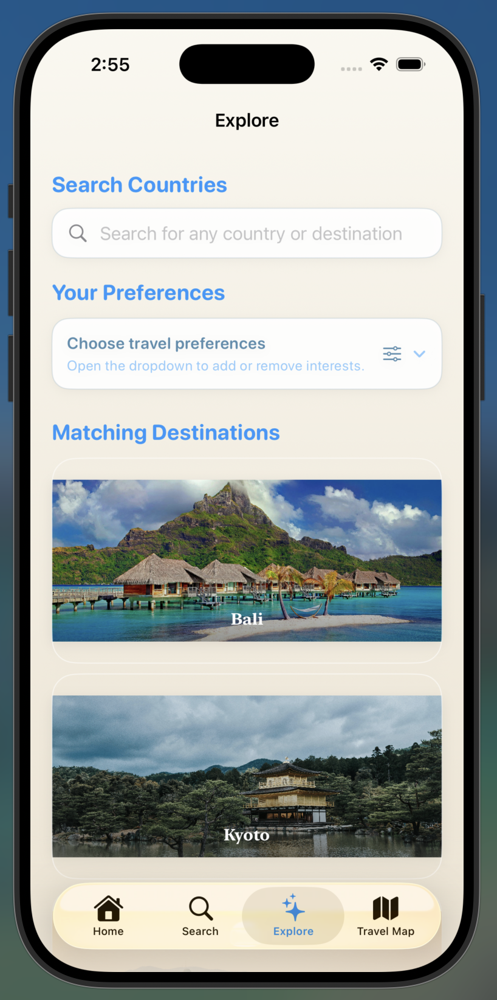
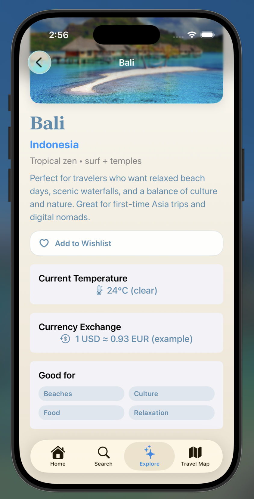

Passport to Paradise

Passport to Paradise is a SwiftUI travel discovery app for helping users explore and find their ideal vacation destinations. The app is designed for people who want inspiration for future trips, whether they are looking for relaxing beaches, exciting cities, outdoor adventures, or scenic places to visit. It focuses on making travel planning feel simple, visual, and enjoyable, with an organized layout and destination-focused details.

Screenshots:

### Home

### Travel Map

### Explore

### Destination Detail

Features:
- Explore different dream travel destinations
- View destination details and travel inspiration
- Discover places based on vacation style, scenery, or interests
- Browse a clean and organized travel-focused interface
- Use navigation to move between travel screens and destination content
- Save or focus on favorite places for future trip ideas

Built With:
- SwiftUI
- SwiftData
- MVVM-style organization
- Xcode
